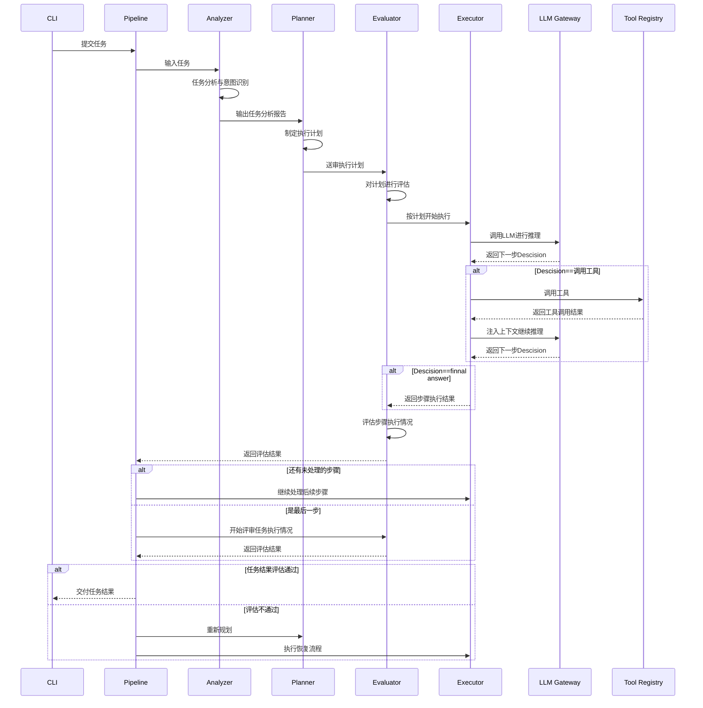
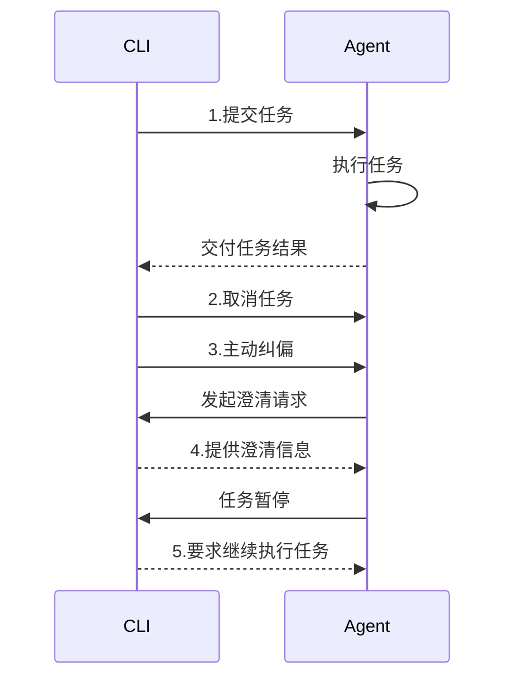

# 从零设计一个生产级 LLM Agent 框架

> ThinkingAgent 是一个轻量级，准生产就绪的LLM Agent 框架，支持多 LLM Provider、复杂任务编排、自动故障恢复和长任务断点续跑。本文记录了我在从0到1构建ThinkingAgent过程中的心路历程，皆是独立思考后的原创观点，如有雷同，纯属巧合。

---


## 目录

[TOC]

## 0. 演示

x x x

------------------------


## 1. 战略规划：What To Do

### 1.1 明确需求与目标

- 能自主分析/规划/执行/验收，帮用户解决一些通用性问题的个人助手

- 能处理需要结合推理和工具调用的任务
- 能处理长周期，多步骤，具有一定复杂性的任务


### 1.2 明确设计原则

**“基础能力”与“可靠性”设计同时进行**

LLM Agent是一个典型的Pipeline系统，在pipeline执行的每一个环节都有可能失败。**每一个可能失败的地方，都要有对应的恢复策略；每一个恢复策略，都要有代价意识。**

这句话包含两个关键点：

第一，"每一个可能失败的地方"——这要求在设计阶段就系统性地思考所有可能的失败模式，而不是等到出问题了再打补丁。

第二，"代价意识"——不是所有失败都需要最激进的恢复策略。比如说只是工具参数写错了，重试一次即可，没必要让LLM重新对任务进行规划。代价意识让系统在可靠性和效率之间找到平衡


### 1.3 确定执行节奏


首先我将Agent的能力划分成如上图所示的四个层次。每一个层次面临不同的领域问题，都是可以独立深入和演进的。同时这四个层次从下到上也代表了Agent能力的进阶路径 。罗马不是一天建成的，第一个版本我给自己设置了一个月的deadline，这种分层可以让我决定在有限的时间内哪些领域可以多花一些精力，哪些少一点；哪些在开始阶段就必须要搞定，哪些可以留给未来做

---


## 2. 系统架构设计：Agent行为的规范化容器

### 2.1 架构分层

ThinkingAgent 采用五层垂直分离架构


### 2.2 架构设计核心思路

一开始我采用传统数据流系统的设计思路来建模ThinkingAgent。但是，随着系统功能迭代和复杂度上升，原来设计好的聚合边界开始模糊，变化传播范围开始失去约束，加入新的feature越来越难，重构信号越来越强烈地显现，让我不得不停下来重新审视自己的设计。LLM Agent与传统数据流系统我觉得最重要的区别就是LLM-in-the-loop，我们需要为LLM这个不确定算子设计围绕其运行的所谓的Harness组件，从架构层面去有力地支撑LLM的动态决策和行为

调整设计思路后，我开始采用DDD领域建模，结合数据流系统的设计方法：

1. 基于数据流的流动和变化，提出系统关键的业务事实
2. 编排这些业务事实发生的时间先后顺序
3. 推导产生这些业务事实的Command和相关约束Policy
4. 根据业务事实/Command/Policy抽聚合
5. 对每一个聚合提取根对象，确定聚合边界和交互契约关系

随着越来越多feature的加入，这一套思维过程会进行N轮，由此产生了ThinkingAgent目前的架构。它肯定不是最好的，但是能满足目前的需要


### 2.3 主体流程

#### 2.3.1 Agent视角



#### 2.3.2 用户视角



上述流程都是省略了非常多细节的骨干流程，仅供参考

### 2.4 领域支撑设计

#### 2.4.1 Pipeline 是唯一的"上帝视角"

一个用户提交一个任务后，ThinkingAgent需要自主规划并完成任务，在任务处理过程中需要所有聚合根的参与。为了不让依赖变成难以迭代和维护的网状依赖，Pipeline作为中央协调者成为这个星形拓扑的唯一汇合点

抽象出Pipeline对象有三个关键动机：

- 串联和协调各个聚合根的动作顺序
- 制造干净的依赖关系
- 未来如果支持多session的并发处理，Pipeline会成为执行流的数据隔离单元，确保运行时上下文的独立性

虽然Pipeline是中央协调者，但不意味着其他聚合之间一点依赖关系都没有。Pipeline解决的是Agent软件架构全局性的依赖问题，但当问题限定到一个非常明确和容易控制的局部领域，聚合之间是可以有直接依赖的。比如ContextManager这个推理上下文管理器就需要依赖上下文裁剪器和token预估器来解决上下文窗口超过模型限制的问题

#### 2.4.2 ComponentAssembler：依赖注入的统一入口

所有聚合根等关键实体的创建都是通过 `ComponentAssembler` 来完成，这不只是为了屏蔽对象创建的细节，更重要的是：

**测试替换**：测试时可以注入 mock 组件，不需要修改业务代码。比如，测试 Pipeline 的恢复逻辑时，可以注入一个总是返回失败的 mock QualityEvaluator，而不需要真正调用 LLM。

**配置集中**：这种系统的配置参数非常多，我需要在一个收口的地方管理所有配置，进而快速调整整个系统的行为

**依赖可见**：组件的依赖关系在`ComponentAssembler` 中一目了然，不会出现隐式依赖。当看到 `build_stage_executor()` 需要传入 `reasoning_manager`、`context_manager`、`quality_evaluator` 等参数时，就能立刻就知道 StageExecutor 依赖哪些组件

**生命周期管理**：`ComponentAssembler` 控制组件的创建顺序，确保依赖关系正确初始化。比如，LLMGateway 必须在 ReasoningManager 之前创建，因为 ReasoningManager 依赖 LLMGateway

#### 2.4.3 PipelineDriver：用户与 Agent 的消息桥梁

`PipelineDriver` 是一个容易被忽视但非常有必要的设计，引入这个实体主要是解决两方面问题

- 支持预定义的产品能力

  一个好的LLMAgent必然要有"与人协同"的能力，比如Agent要求用户权限放过，信息澄清，二次确认，或者用户主动想对任务执行进行引导等等。因此ThinkingAgent需要在任务执行过程中与用户进行各种指令的交互，`PipelineDriver`负责管理暴露给Entry层的异步消息队列，对用户和Agent之间交互的消息进行收发和传递

- 技术上的防腐层

  为了保障Pipeline/Agent Model层实现的稳定，Driver需要负责用户消息和Agent Command的互转，以及安置一些杂七杂八的非领域逻辑

#### 2.4.4 EventBus事件总线：解耦通知

ThinkingAgent使用事件驱动的方式处理异步化操作，在系统设计阶段就已经定义好了完整的系统领域事件，这些领域事件会被Agent Model通过 `EventBus` 发布，这意味着：

- 事件发布者不需要知道谁在监听和完成事件
- Checkpoint保存，可复用知识/用户偏好数据提取，监控系统、审计日志等都可以独立订阅感兴趣的事件
- 添加新的监听者不需要修改任何现有代码

系统定义了 15+ 个领域事件，覆盖从任务分析开始到最终交付的完整生命周期：`TaskAnalysisStarted`、`PlanGenerateSucceed`、`StageExecutionStarted`、`ToolCallStarted`、`ToolCallResultProduced`、`TaskExecutionSucceed` 等。

这些事件不只是用于通知，它们也是系统状态的完整记录。通过订阅所有事件，可以重建任务执行的完整时间线，这对于调试和审计非常有价值

---


## 3. 基础能力层：感知、记忆、执行的通用基座

### 3.1 推理框架

#### 3.1.1 推理模式：Plan-and-Execute Agent with Self-Reflection


ThinkingAgent的推理模式如上图所示：一个任务首先会被拆解成不同的执行步骤Stage，Stage之间有明确的依赖关系，比如上图中Sta ge3要依赖Stage1和Stage2的输出。每个Stage输出的结果必须流经一个Reflection节点，通过反思机制对结果执行评估。如果评估不通过，会触发Stage的重新规划或者原地重试；如果评估通过就继续按照计划处理后续的Stage。每个Stage内部的工作流程是跑一个ReAct工作循环。总结起来，ThinkingAgent是以**Plan-and-Execute为骨架**，以**ReAct为血肉**，以**Reflection为进化驱动力的混合式智能体**

#### 3.1.2 三段式循环: 系统主体控制流结构

ThinkingAgent的Pipeline流程包含非常多的处理步骤，同时还要考虑所有步骤可能的出错模式和对应的恢复逻辑，复杂度很高。在最开始落地时这个系统主体的控制循环逻辑达到了几千行代码，非常难维护和迭代。那面对一个复杂的东西，一个自然而然的想法就是分治，进行关注点分离，经过优化的Pipeline Loop开始采用如下图所示的三级嵌套循环结构


承接上文，这样设计的目的主要有2个：

- 适配ThinkingAgent的推理模式，简化复杂控制流的决策树深度
- 解耦不同的异常情况，让对应的可靠性处理逻辑更原子化

##### 3.1.2.1 Task级循环

本层循环主要关注:

- 任务分析
- 重写用户问题
- 制定和评审任务执行计划
- 调用步骤级工作循环
- 评审任务交付结果
- 原计划重试或者重新规划
- 知识和用户偏好提取

##### 3.1.2.2 Stage级循环

本层循环主要关注:

- 模型路由
- 调用推理级工作循环
- 评审步骤执行结果
- 执行评审不通过时的恢复流程
- Checkpoint保存

##### 3.1.2.3 推理级循环

最内层的推理循环主要关注：

- 非阻塞轮训用户协同指令

- 构建上下文窗口

- 调用LLM获取决策

- 根据决策结果进行"工具调用"等分支处理

  

### 3.2. 任务分析：让 Agent 真正理解任务

#### 3.2.1 为什么需要任务分析？

ThinkingAgent接收到用户提交的任务后先进行**任务分析(Task Analysis)**。

这个步骤的价值在于：**把一个模糊的自然语言请求，转化为一个结构化的、机器可处理的任务描述**。

为什么这很重要？考虑这样一个用户请求："帮我分析一下上个季度的销售情况"。

这个请求包含很多模糊性：

- "上个季度"是哪个季度？需要根据当前日期计算
- "销售情况"包括哪些维度？总销售额、同比增长、分产品线、分地区？
- 数据在哪里？数据库？Excel 文件？
- 输出格式是什么？文字报告？图表？表格？

如果直接把这个模糊的请求交给 Planner，生成的计划很可能不够精准，执行过程中会遇到各种问题。任务分析的作用就是在执行之前，把这些模糊性尽可能消除

#### 3.2.2 分析产出的信息

`Analyzer` 通过 LLM从用户的输入中主要想获得以下四方面信息：

**（1）任务语义层面**

`task_type` 标识任务的类型，比如"数据分析"、"代码生成"、"信息检索"、"文档处理"等。这个字段直接影响模型路由——不同类型的任务适合不同的 LLM 提供商

`intent` 捕捉用户的真实意图，有时和字面意思不同。比如，"帮我看看这段代码有没有问题"的真实意图可能是"代码审查并给出改进建议"，而不只是"找 bug"

`task_goal` 描述任务的最终目标，用于在整个执行过程中保持方向一致。每个阶段的执行提示词都会包含 `task_goal`，确保 LLM 不会在细节中迷失方向

`entities` 提取任务中涉及的关键实体，并进行规范化处理。比如：

- "上周五" → "2026-05-15"（具体日期）
- "AAPL" → "AAPL"（股票代码，已是标准格式）
- "销售数据库" → 需要进一步确认具体的数据库名称

实体规范化很重要，因为 LLM 在后续步骤中需要使用这些实体，规范化后的格式更不容易出错

还有其他字段，不一一赘述

**（2）执行约束层面**

`action_constraints` 捕捉用户的行为约束，比如"不要修改原始文件"、"只查询不写入"、"不要调用外部 API"等。这些约束可以避免Agent 做出用户非期望操作

`output_constraints` 捕捉输出约束，比如"输出 Markdown 格式"、"结果要包含数据来源"、"不超过 500 字"等。这些约束在质量评估时作为评估标准之一。

`risks` 识别任务的潜在风险，比如"数据可能过时"、"成本可能超支"、"任务范围可能蔓延"等。这些风险信息会被Planner识别，在生成计划时会考虑这些风险

还有其他字段，不一一赘述

**（3）工具匹配层面**

Analyzer 对每个可用工具计算相关性评分，这个评分不是简单的关键词匹配，而是语义层面的相关性判断。比如，对于"分析 Excel 销售数据"这个任务，`excel` 工具的评分会很高，`flight_search` 工具的评分会很低（接近 0），`run_python` 工具的评分会中等（因为 Python 也可以处理 Excel，但不如专用工具）

**（4）模型路由提示**

产生给模型路由器的结构化提示，比如：

- `required_capability_tags`：任务需要的能力标签（如 "code"、"tool_use"、"long_context"）
- `estimated_context_tokens`：预估的上下文 token 数（用于过滤上下文窗口不够大的提供商）
- `latency_sensitive`：是否对延迟敏感（影响提供商选择）
- `cost_sensitive`：是否对成本敏感（影响提供商选择）

#### 3.2.3 分析结果如何影响后续流程

任务分析的结果不只是给 Planner 看的，它贯穿整个执行流程：

**影响模型路由**：路由提示直接输入到 `CapabilityMatchStrategy` 的评分算法中，影响哪个 LLM 提供商被选为主选。

**影响工具过滤**：工具评分决定向 LLM 暴露哪些工具。这个过滤在计划生成后还会再做一次（Planner 在生成计划时会对工具进行二次打分），最终会结合两次评分的综合情况为任务选择执行工具

**影响计划生成**：任务分析的输出会用来帮助Planner生成更精准的计划。比如，如果 `risks` 中包含"数据可能过时"，Planner 可能会在计划中加入"验证数据时效性"的步骤

**影响阶段执行**：像`task_goal` 和 `intent` 等重要任务语义信息会在每个步骤的推理过程中使用，确保执行方向的一致性，防止LLM 在执行某个具体步骤时，忘记了任务的原始目标，做出了局部正确但全局错误的决策

**影响质量评估**：任务分析的一些输出是评估标准之一。比如用户明确要求"输出 Markdown 格式"，但最终结果是纯文本，质量评估会标记为不通过

#### 3.2.4 知识注入

ThinkingAgent是在任务分析结束后进行知识注入的，这样设计的出发点是：对于某些受众，比如一个公司，它的知识库规模很庞大。用户提交的原始任务描述可能本身就存在语义模糊，逻辑自相矛盾等现象。如果基于用户原始描述去做知识的检索和注入会产生大量噪音，影响Agent的后续的推理和行动。

而之所以需要进行知识注入，主要是解决两方面问题：

- 一些私域知识没有被大模型训练过，如果没有它们可能导致特定任务的推理轨迹断裂
- 提升Agent工作效率，不用什么工作都从头开始摸索

##### 3.2.4.1 知识Entry设计

ThinkingAgent的KnowledgeEntry主要包含以下一些关键字段：

- entry_id: 唯一性ID
- 元数据(文档名，路径，标题，摘要，文档类型，创建时间)
- 索引信息（比如块索引）
- 内容块

##### 3.2.4.2 检索设计

ThinkingAgent的知识检索分为以下三个阶段：


最终的返回被作为知识注入到上下文中。因为本文旨在描述ThinkingAgent的整体设计，因此RAG部分先不详细说明

#### 3.2.5 用户偏好注入

用户的原始偏好Entry以键值对方式存储在系统中，比如：

```
"购物时筛选排序方式": "按价格从低到高"
```

ThinkingAgent有一个周期性任务负责对用户近期的原始偏好Entries进行总结。不同于知识注入，Agent在任务分析阶段就会将总结好的用户偏好信息注入到任务分析上下文中，Analyzer需要基于用户提交的任务信息决定应用哪些偏好，并将被应用的偏好信息转化到输出报告里的"执行约束","工具匹配","模型路由提示"等字段中。这些字段内容会被后续的Planner，ModelSelector，QualityEvaluator组件使用，以便在任务执行过程中去对齐用户的偏好


### 3.3 提示词工程

#### 3.3.1 基于模板的提示词管理

ThinkingAgent使用模板管理Agent所需要的所有提示词，再通过模板引擎渲染出最终的提示词，一个提示词模板举例如下:

```python


## Feedback on Previous Plan
{{ feedback }}

## Instruction
Produce a completely revised execution plan that addresses the feedback above......
```

这样做是为了获得四方面的收益：

1. **提示词和代码分离**：修改提示词不需要改代码，可以独立迭代
2. **模板复用**：多个提示词可以共享公共片段（比如系统角色描述）
3. **动态内容注入**：通过模板变量，可以把任务信息、计划信息等动态内容注入提示词，而不需要字符串拼接
4. **版本控制的含义**：提示词文件和代码文件都在 Git 中管理。这意味着提示词的每次修改都有完整的历史记录，可以回滚，可以方便进行A/B Testing

#### 3.3.2 系统提示词设计

烂大街的东西不再赘述，这里只着重提几点实践过程中让我有一些新感觉的东西

##### 3.3.2.1 从第一性原理出发

提示词的目的让Transformer机能够采样出我想要的东西，所以我的一些思考点放在如何利用现代大模型的计算过程，大模型训练方法的特点，训练燃料的模式去反推或者约束提示词设计。这个领域本身即可独立成文，篇幅有限，本文只列举一个应用示例：**注意力的U形曲线**

- 注意力的首因效应

（1）因为因果掩码导致的注意力结构性偏置，引发越靠近头部的token得到的关注机会越多

（2）基于梯度下降的训练动力学为了让损失下降地最快，逐步进化的网络结构会偏向让靠近头部的token成为**注意力吸引子**

（3）在Transformer的推理阶段，经过每一层固定的Q/K/V投影，自注意力，FFN计算，头部token的隐藏状态被逐步扭曲，专门用于“吸引全局注意力”的特征被不断增强，形成一个**位置-角色标记**。这个过程不以输入token的嵌入表示为转移，无论是谁，通过这样的网络计算都会产生一个高吸引力的K表示

（4）后续token的Q因为训练中学到的偏好，会与头部token的K产生高点积，因此进入Softmax后获得更多注意力权重

（5）因为高的注意力权重，头部token的V向量需要有为更好预测而具备的“全局语境”信息，头部token被彻底塑造成信息锚点

- 注意力的近因效应

  现代大模型的采用的位置编码技术，比如RoPE旋转位置编码，会导致与距离越远的token计算得到的注意力越小，引发注意力权重随着距离剧烈衰减，但这并不会让首因效应消失

- 对于一个token序列来说，因为两端高注意力的挤压，导致中间token的注意力权重降低，形成一个U形曲线

在ThinkingAgent的Prompt设计中对U形曲线特征的运用，主要体现在：在一次推理上下文的头部会放置任务级，全局性的重要提示，而尾部则随着Agent的运行，不断被动态插入预防性的纠偏引导

##### 3.3.2.2 工具选择的优先级提示

**工具选择的优先级规则**（first match wins）：

```
简单数学/单函数 → calculator
多步数据处理/numpy/pandas → run_python
纯文本/CSV 文件 → file
Excel 文件 → excel（先用 inspect 检查布局）
Shell 命令 → shell（避免长时间运行或交互式命令）
SQL 数据库 → SQL 工具（先检查 schema；始终用参数化查询）
语义/模糊查找 → 向量搜索工具
当前时间 → current_time
网络事实/近期事件 → search
.....
```

这个优先级规则解决了一个常见问题：LLM 在面对多个可用工具时，往往会选择"万能"工具（如 run_python）而不是最合适的专用工具。明确的优先级规则引导 LLM 做出更精准的工具选择。

比如，对于"计算 sqrt(144)"这个简单任务，如果没有优先级规则，LLM 可能会选择 `run_python`（写一段 Python 代码来计算）。但实际上，`calculator` 工具更合适——它更轻量，不需要启动 Python 解释器，也不需要处理代码执行的安全问题

##### 3.3.2.3 为副作用设计提示词

有很多任务不止是要一个推理答案，还需要额外输出一些东西，比如输出一篇文档。我把这些额外输出的产物命名为推理的副作用。在实践中我发现在具有Self-Relection的推理模式里，如果不为副作用设计提示词，容易引发结果评估不通过，进而开始触发Agent执行恢复流程。因此需要显示地为这些副作用设计一些提示，比如：

```cmd
If the task involved creating, saving, editing, or running something:
- Pass when the result gives credible evidence of success, such as a file path, saved filename,
  command output, or concise summary of the change.
- Do not require the full contents of a saved file to be repeated inline unless the task or
  output constraints explicitly require inline content.
- Fail if the result merely claims success but gives no usable way to locate or verify the
  artifact, or if the claimed artifact contradicts the requested path/name/format
```

我认为一个Agent做Self-Relection的输入应该定义为从副作用中抽取的特征，而不是副作用内容本身，这种方式效果更稳定也更经济。比如一个任务：

让Agent输出一个详细的旅行计划，内容不超过3000字

我的方法是让ThinkingAgent通过**执行约束**来理解"3000字这个约束"，它会在Execute阶段去检查自己的输出是否满足字数要求，然后输出一条checklist summary，like "使用shell工具统计文档字数为2988字，满足不超过3000字要求"。Agent评审的输入只需要这个checklist summary，而不是整个文档内容


### 3.4 检查点机制：长任务的生命线

#### 3.4.1 问题背景

ThinkingAgent被设计成需要处理多步骤和具有一定复杂性任务的Agent，这些任务的处理时间往往都是小时级别，最蛋疼的情况是眼看临门一脚，结果因为诸如“推理偏离目标”等原因，任务没有得到完成

**为什么Agent 任务特别脆弱？**

第一，**执行时间长**：一个复杂的 Agent 任务可能需要几十分钟，小时，甚至天级别，期间任何一个环节出问题都会导致整体失败。执行时间越长，遇到问题的概率越高

第二，**调用成本高**：每次 LLM 调用都有真实的 API 费用。一个 30 分钟的任务可能花费几美元，从头重来意味着双倍成本。

第三，**状态不可重现**：Agent 任务的中间状态往往是不可重现的——第 3 步生成的数据分析结果，第 4 步的图表，这些都是 LLM 在特定上下文下生成的，重跑不一定得到完全相同的结果

检查点机制就是为了解决这个问题：**让长任务在任何时间点崩溃后，都能从最近的成功节点继续，而不是从头开始**

#### 3.4.2 保存时机的设计：为什么是"评估通过后"

检查点的保存时机是一个关键设计决策。有几种选择：

**方案 A：每次工具调用后保存**

最细粒度的方案。每次工具执行完毕，立即保存检查点。

问题：工具调用非常频繁，一个阶段可能有 10-20 次工具调用。每次都保存意味着大量的磁盘 I/O，而且大多数中间状态并没有保存价值——一个阶段执行到一半的状态，恢复后也无法直接继续，还是需要重新执行这个阶段。

**方案 B：每次 LLM 推理后保存**

比方案 A 稍粗一些，但问题类似。LLM 推理的中间状态（比如"正在思考下一步用什么工具"）没有独立的恢复价值。

**方案 C：每个阶段完成后保存（不管质量如何）**

每当一个阶段的 ReAct 循环结束，LLM 给出了最终答案，就保存检查点。

问题：这个阶段的结果可能是错误的。如果我们保存了一个质量不合格的阶段结果，恢复后继续执行，后续阶段会基于这个错误结果继续，最终产出的任务结果也会是错误的。

**方案 D（ThinkingAgent 的选择）：每个阶段通过质量评估后保存**

只有当阶段结果通过了 `QualityEvaluator` 的评估，才保存检查点。

这个设计的核心洞察是：**检查点保存的是"已验证的进度"，而不是"已完成的工作"**

只保存通过评估的阶段，确保了每个检查点都是一个"已知良好"的状态。从这个状态恢复，后续执行可以安全地依赖之前阶段的结果

#### 3.4.3 哪些内容要放进检查点

ThinkingAgent的检查点包含如下图所示的6个方面内容：


### 3.5 工具系统：保持简单而强大

#### 3.5.1 工具过滤与按需加载

ThinkingAgent 在执行任务前，会对所有可用工具进行过滤，只把与任务相关的工具的 Schema 加载到LLM 的上下文中。这个过滤过程使用了两遍打分机制。

**为什么需要过滤工具？**

系统要支持的工具会越来越多，全部工具的Schema会消耗大量token。同时，与任务无关的工具会干扰 LLM 的决策，影响任务交付的成功率

**第一遍：Analyzer 打分**

任务分析阶段，`TaskAnalyzer` 会对每个工具进行相关性评分。这个评分基于任务描述和工具描述的语义相似度：即这个工具对完成这个任务有多大帮助？

Analyzer 的视角是**任务整体**：它看的是整个任务描述，评估工具对整个任务的相关性。

**第二遍：Planner 打分**

计划生成阶段，`Planner` 在生成执行计划时，会对每个工具再次打分。这个评分基于计划的具体步骤：这个工具在执行计划的某个具体步骤时会被用到吗？

Planner 的视角是**执行细节**：它看的是具体的执行步骤，评估工具在实际执行中的使用可能性。

两遍打分捕获不同的信息，工具选取时要求两种分数都要超过预设的阈值

#### 3.5.2 工具扩展与自动发现

ThinkingAgent的每个工具都要遵循相同的接口协议，对于新增的工具，既支持手动注册，也支持基于反射机制的自动发现和注册

#### 3.5.3 Anti-Skills

仅代表个人观点，从技术角度我觉得Skills是没有意义的过渡性产物（从产品角度，比如推动传统行业数字化转型，确实有点用），Agent想要对外部能力进行更高质量地集成，要么想办法提升大模型本身的能力，要么想办法制造一个高质量的推理轨迹。本着这样一个意识形态，ThinkingAgent的设计遵循了以下的思路：

- 工具要简约，具备好的场景适应性和能力泛化性，就像Shell一样
- 所有SOP，资料，文档等信息等被纳入到“知识”的范畴；人设，风格等被纳入“用户偏好”的范畴
- 工具的按需加载源于Analyzer和Planner的共同决策
- 知识的按需加载源于检索技术+LLM
- 对于单个用户而言，结合时效性考虑，一个人偏好数据的数据量不会很大，因此可以采取“定期总结，整体加载”的策略

---------------


## 4. 可靠性体系建设：兜底与自愈的生存底线

LLM Agent 执行复杂任务时，工具调用可能失败，LLM 可能给出错误的推理，计划可能不合理，LLM Provider API可能不稳定等等，所以对于Agent来说失败是常态，不是异常。因此可靠性设计的重心不是**如何避免失败**，而是**失败后如何以最小代价恢复**

处理可靠性最麻烦的点就是它无处不在，每个环节，每次调用都要考虑。而因为大模型的介入，这个问题变得更麻烦。比如你没有看到系统有任何异常和报错，但推理轨迹就是陷入局部死循环，就是偏离目标。常规系统面临的可靠性问题Agent要cover，而大模型引发的**推理可靠性**问题，LLM Agent也同样要提出对应的处理手段

### 4.1 可靠性设计思路

#### 4.1.1 Pillar-Layer异常处理


在“3.1.2三段式工作循环”章节有提到说这样的程序控制流结构有利于可靠性处理逻辑的设计，正如上图所示，ThinkingAgent的可靠性逻辑结构与工作循环结构是相辅相成的。每一个横向的切面关注着Pipeline执行的不同层级，也同时关注它要处理异常的层级；而纵向穿插的数轴代表着贯穿所有层次，独立的推理上下文。推理上下文领域的异常有它自身的特点，需要单独思考。

ThinkingAgent的宗旨是让每一层尽可能处理本层发生的异常，如果发现本层因为缺失必要信息没法处理，就向临近的上层抛出该异常（**备注**：本节提到的**异常**是一个统称，代表破坏可靠性的所有原因。技术实现的载体可能是错误码，Exception，甚至一个普通对象都可以）。不同Level关注的异常，发现机制和恢复手段如下表所示：

| Level         | 关注点                                                       | 发现机制                                                     | 恢复手段                                                     |
| ------------- | ------------------------------------------------------------ | ------------------------------------------------------------ | ------------------------------------------------------------ |
| Task          | Task最后交付的结果是否可靠                                   | - Evaluator主动评估<br>- 下层返回的异常                      | - Retry原计划<br>- 重新制定计划并执行                        |
| Stage         | - Stage处理流程是否满足规定的约束<br>- Stage处理流程是否匹配任务整体目标<br>- Stage的交付结果是否可靠，可以向后传递 | - Evaluator评估<br>- 下层返回的异常                          | - 原Stage直接重试<br>- 本Stage重新规划并执行<br>- 本Stage+后续Stage重新规划并执行<br>- 重新制定整个计划并执行 |
| Reasoning     | 一次推理动作是否成功完成                                     | 下层返回的异常                                               | 模型切换                                                     |
| LLM Gateway   | 关注与不同厂商API交互的异常                                  | - 本地检查LLM回包的完整性<br>- 不同厂商API返回的错误信息     | - 本地修复LLM回包<br>- 带Jitter的Backoff<br>- 错误注入上下文由LLM自行处理<br>- 模型降级 |
| Tool Registry | 工具调用的异常                                               | - 调用前检查<br>- 连续重复调用纠偏<br>- 具体工具返回的错误信息 | - 带Jitter的Backoff<br>- 自动插入纠偏Prompt<br>- 工具降级<br>- 错误注入上下文由LLM自行处理 |
| Context       | 推理轨迹的可靠性                                             | 获取本轮推理所需上下文的一系列检查，见章节4.2                | 上下文修复/压缩                                              |

（**备注：**“模型切换”指的是切换不同的LLM厂商，“模型降级”是同厂商不同模型版本的切换）

#### 4.1.2 带行为的标准化异常

为了简化调用端逻辑对异常的理解成本，同时尽量让异常的处理往标准化和程式化方向发展，ThinkingAgent扩展了标准错误码体系的设计：

- 在原有错误码基础信息（Category+code+message）之上增加了caller action和action data等用于恢复异常的输入信息，直接驱动调用端的恢复行为

- 对于来自第三方的错误（比如各个LLM厂商API的报错信息），需要在适配器层将个性化错误信息映射到标准错误码

- 错误码的展示逻辑与恢复逻辑分离，调用端如果需要记录日志，trace这些就用code/message等只读信息；而要恢复异常则使用caller action和action data；甚至对于那些恢复手段明确，简单的异常，ThinkingAgent中直接通过表驱动就解决了

  下图展示了一个ThinkingAgent中标准错误码的例子：

```python
# Auth / Permission
AgengNormalizedError.AUTH_FAILED:           (ErrorCategory.AUTH,           CallerAction.SWITCH_MODEL),
AgentNormalizedError.PERMISSION_DENIED:     (ErrorCategory.AUTH,           CallerAction.SWITCH_MODEL),
.....
# Content Policy
AgentNormalizedError.CONTENT_FILTERED:      (ErrorCategory.CONTENT_POLICY, CallerAction.DEGRADE),
AgentNormalizedError.INPUT_CONTENT_POLICY:  (ErrorCategory.CONTENT_POLICY, CallerAction.DEGRADE),
.....
```

#### 4.1.3 基于代价设计恢复策略

除了一些特别hard的异常（比如耗尽任务重试次数），其他大部分异常发生时我们都希望能让Agent的执行重回正常的推理轨迹。而不同的恢复策略关乎到token消耗，关乎到时间效率。所以带着代价的意识去思考如何进行异常恢复是自然而然的，这里面暗含了两个子问题：a. 要设计一个基于代价的，有优先级的恢复策略(从最低代价开始尝试恢复) （2）恢复策略需要能自动升级（低代价方式恢复不了时必须升级）

举一个例子——假设任务是"分析销售数据并生成报告"，计划有 5 个步骤：

1. 连接数据库，查询销售数据
2. 清洗和预处理数据
3. 计算关键指标
4. 生成可视化图表
5. 撰写分析报告

如果第 3 步（计算关键指标）的结果不正确，应该怎么恢复？

- 如果是因为 SQL 查询写错了（比如 GROUP BY 字段选错了），直接重试当前步骤就够了——LLM 看到错误结果后会修正查询
- 如果是因为第 3 步的计划描述不够清晰，导致 LLM 不知道要计算哪些指标，微调本步骤的执行策略更合适——重新生成第 3 步的计划，明确指定要计算的指标
- 如果是因为第 2 步的数据清洗有问题，导致第 3 步的输入数据就是错的，从第 2 步开始重新规划是最合适的
- 如果是因为整个计划的分析思路就不对，重新制定新的执行计划才是正确选择

ThinkingAgent通过在上下文中注入**恢复策略**，**触发条件**，**代价信息**等提示词来引导LLM优先选择代价最低的那个恢复方案

另一个点就是恢复策略需要有自动升级机制，避免“死磕”。比如ThinkingAgent发现某步骤的执行次数已经超过单步骤最大允许重试次数，此时会在推理上下文中自动插入引导提示：“对于StepN，你已经进行了XX次重试，超过了系统允许的步骤重试次数，现在需要从其他恢复策略中选择一个你认为最合适的执行，注意选择恢复策略时同样需要考虑#3.1中列举的代价信息和触发条件......”

#### 4.1.4 低置信度澄清

在ThinkingAgent里面除了LLM-in-the-loop，也同时建设了Human-in-the-loop。当面对复杂任务时，人的介入和协同是无可避免的。而回到“可靠性处理”这一part，当ThinkingAgent发现置信度过低，需要用户二次确认和澄清时，会主动发送消息给CLI端，并有限等待用户的澄清信息。低置信度澄清在ThinkingAgent的任务分析，计划制定，计划执行，结果评估阶段都有可能发生

#### 4.1.5 不可变对象

核心领域对象（`Task`、`Plan`、`PlanStep`）被声明为不可变，这是一个防御性设计决策。

在并发环境中，可变的共享状态是 bug 的温床。如果 `Task` 对象是可变的，那么在 Pipeline 读取 `task.task_goal` 的同时，另一个线程可能正在修改它，导致难以复现的竞态条件。

不可变对象从根本上消除了这类问题：一旦创建，对象的状态就不会改变。需要"修改"时，创建一个新对象。这种模式在函数式编程中很常见，在并发场景下尤为有价值


### 4.2. 上下文管理

一个好的推理轨迹是LLM Agent最大的技术壁垒，而上下文管理就是对推理轨迹最重要的托举

#### 4.2.1 问题的复杂性来源

- 给到LLM厂商的推理上下文都是带role的消息，不同的LLM厂商对于带role消息的编排有严格约束条件（比如tool call/tool result消息要基于call_id配对，同种role的消息不能连续出现等等）
- 不同厂商对于context window大小有限制，对于输出的token数也有限制，需要在有限的空间内既保证推理满足任务的需要，也要保证推理轨迹不断裂不失真，还要让每次LLM的回复都对推理的前进有正向推动
- token是要烧钱的，在上下文管理里面需要考虑经济性问题

#### 4.2.2 双缓冲设计：当前上下文与history 分离

`ContextManager` 维护两个独立的消息列表：

```
_ctx_window  ← 当前活跃上下文（可增删）
_history     ← 完整追加历史（只增不删）
```

**为什么要分离？**

`_ctx_window` 是发给 LLM 的实际内容，需要根据 token 预算动态调整。`_history` 是完整的审计记录，永远不删除。

这两个列表的用途完全不同：

`_ctx_window` 用于：

- 构建发给 LLM 的请求（`get_context_window()`）
- 阶段回滚（删除失败阶段的消息）
- 检查点保存（保存当前活跃上下文）

`_history` 用于：

- 知识提取（从完整对话历史中提取有价值的信息）
- 偏好学习（从完整对话历史中学习用户偏好）
- 审计和调试（完整记录任务执行过程）

当阶段执行失败需要回滚时，我们从 `_ctx_window` 中删除该阶段的消息，但 `_history` 保持完整。这意味着即使某个阶段被回滚了，它的执行记录仍然保留在历史中，可以用于后续的分析和学习。

**内存代价**：双缓冲设计的代价是内存占用翻倍。对于长任务，`_history` 可能积累大量消息。但这个代价是值得的——完整的历史记录对于知识提取和调试来说是不可替代的。

#### 4.2.3 上下文自动修复：五步修复法

每次调用 `get_context_window()` 前后，都会运行一个五步修复管道，确保发给 LLM 的消息序列是合法的：

```
原始消息列表
    │
    ▼ Step 1: _drop_leading_tool_results()
    │  删除出现在任何 tool_use 之前的孤立 tool_result 消息
    │
    ▼ Step 2: _ensure_first_message_is_user()
    │  删除开头的非 user 消息，直到第一条 user 消息
    │  （所有主流 LLM API 要求对话以 user 开始）
    │
    ▼ Step 3: _repair_tool_pairs()
    │  检查每个 tool_use 是否有对应的 tool_result
    │  对于没有 result 的 tool_use，注入合成的错误结果
    │  对于没有对应 tool_use 的 tool_result，直接删除
    │
    ▼ Step 4: _drop_trailing_tool_use()
    │  删除消息列表末尾的 tool_use 消息（没有对应 result）
    │  （Step 3 的安全网，防止边缘情况）
    │
    ▼ Step 5: _merge_consecutive_same_role()
       合并相邻的同角色消息（tool_use 和 tool_result 除外）
       （Anthropic API 拒绝连续的 user 或 assistant 消息）
```

这个修复管道确保无论上游发生什么（截断、阶段回滚、检查点恢复），发给 LLM 的消息序列始终合法

#### 4.2.4 Token 预算管理：角色分配制

上下文窗口的 token 预算不是平均分配的，而是按角色分配：

```
总预算 (total_budget)
    │
    ├─ 预留区 (reserved_tokens = total_budget × reserve_ratio)
    │       用于 LLM 响应输出 + 未来可能的摘要调用
    │       这部分不能被输入消息占用
    │
    └─ 可用区 (available_tokens = total_budget - reserved_tokens)
            按角色比例分配：
            ├─ system 消息：ratio_system × available
            ├─ user 消息：ratio_user × available
            ├─ assistant 消息：ratio_assistant × available
            └─ tool 消息：ratio_tool × available
```

**为什么要预留区？**

如果输入消息把 token 预算用满了，LLM 就没有空间输出响应了。预留区确保 LLM 始终有足够的 token 来生成完整的回复。

这个问题在实践中比想象的更常见。当任务执行到后期，上下文中积累了大量的工具调用结果（有些工具的输出可能很长），很容易把 token 预算用满。如果没有预留区，LLM 后续的响应就会被截断，极易引发推理轨迹的断裂

**为什么要按角色分配而不是总量控制？**

不同角色的消息有不同的重要性和压缩空间：

- system 消息包含关键指令（ReAct 系统提示、阶段提示），不应该被截断
- user 消息包含任务描述和用户指令，重要性高
- assistant 消息包含 LLM 的推理过程，可以适当压缩（保留最近的，删除较早的）
- tool 消息（工具执行结果）往往很长，但可以大幅压缩（只保留关键信息）

按角色分配可以让压缩策略更精细：当 token 超限时，优先压缩 tool 消息，其次是较早的 assistant 消息，最后才考虑 user 消息。

#### 4.2.5 上下文压缩处理设计

##### 4.2.5.1 消息BLOCK和GROUP

ThinkingAgent上下文压缩流程的输入不是原生的基于role的消息，而是经过上下文预处理和解析后形成的语义块(BLOCK)和语义组(GROUP)，如下图所示：


- 语义块(BLOCK)：代表不可再分割的原子语义单元，比如工具的调用和对应的回复消息必须做好配对并放在一个语义块中。ThinkingAgent中的语义块BLOCK有四种，分别是：SYS块，USER块，ASSIATANT块和TOOL块，它们分别对应system prompt，用户prompt，独立的推理assistant消息和工具调用/回复消息

- 同属于一个Stage的BLOCK被划分成一个GROUP

  将消息分成BLOCK和GROUP的目的是为了在推理上下文中制造一个个语义完整的“信息单元”，这些“信息单元”是压缩算法保障推理轨迹不断裂的数据结构基础

##### 4.2.5.2 压缩策略

ThinkingAgent的主要压缩策略汇总如下表所示：

| #    | 策略                     | 含义                                                         |
| ---- | ------------------------ | ------------------------------------------------------------ |
| 1    | 消除重复的工具调用消息   | 同样的工具和同样的参数连续调用多次，只保留最近的一次，同时打上代表重复信息的标记 |
| 2    | 简化工具调用失败消息     | 去掉工具调用失败的回包细节，修改为一句精炼的表达失败的消息   |
| 3    | 缺省工具调用中过长的参数 | 过长的参数只保留开头，缺省掉剩余部分，并打上缺省标记...(truncated) |
| 4    | 缺省工具回复中过长的字段 | 对于回复中过长的字段只保留开头，缺省掉剩余部分，并打上缺省标记...(truncated) |
| 5    | 将GROUP替换为总结性摘要  | 让LLM对部分GROUP进行总结，用总结后的内容替代原GROUP消息，并打上摘要标记 |

##### 4.2.5.3 推理轨迹的消息布局


这个推理轨迹的消息分配和布局有几个特点值得注意：

- 使用 Tool Call消息呈现执行计划的制定和内容
- 重写后的结构化Task Description使用user role消息呈现
- Agent自动插入的纠偏消息使用user role
- 一个Tool Call Block可能包含不止一次工具调用，调用次数取决于LLM的具体回复。如果出现连续工具调用，则会把一个assistant role的call消息和多个tool role的回复封装到一个BLOCK里
- 每个Stage开始执行时首先会插入一个user role消息来说明本Stage的执行目标/关键产出/执行约束等信息，同时会再次强调任务整体的目标/用户的真实意图

一个推理轨迹就是与LLM一次完整对话的过程，ThinkAgent想将这个对话塑造成：

1. 以常规的角色话术开始 -> 描述本次任务各维度的信息 -> 任务整体的规划 -> 单个步骤具体执行策略 -> 单个步骤的执行过程 -> 单个步骤的执行结果 -> [下一个步骤相关] -> ...... ->  任务最后的输出结果
2. 在单个步骤的执行前callback任务整体的目标，用户真实意图等全局性信息，避免LLM陷入细节，偏离整体目标

##### 4.2.5.4 压缩处理过程


简化后的压缩过程描述如下：

```python
【Step1】: 计算剩余预算=（总预算-Group0的token消耗-当前处理过程中的Group的token消耗-给LLM回复预留的token预算）* 0.7[0.3是给可能的摘要输出预留]
【Step2】: 除了Group0和当前正在处理的Group，对其他BLOCK消息都运行章节4.2.5.2中策略1，执行后检查预算情况，如果满足预算就提前退出
【Step3】: 从最后一个Group（图中示意的Group N）的最后一个BLOCK开始倒序扫描，目的是看剩余预算还能保住几个BLOCK。找到开始不能满足预算的第一个BLOCK作为分割点(图中红色虚线箭头)
【Step4】: 划分分割点所在的GROUP以及处于其上方（代表时间更早）的GROUPS为“可处理GROUPS”区域，划分分割点所在的GROUP以下的GROUPS为“预算内GROUPS”区域
【Step5】: 对可处理GROUPS区域内的所有BLOCK依次实施章节4.2.5.2中策略2/3/4，每个策略实施后检查预算情况，如果满足预算就提前退出
【Step6】: 对可处理的GROUPS区域内的每个GROUP进行摘要总结（章节4.2.5.2中策略5），总结时需要排除**Stage Description首BLOCK，将一个GROUP内的其他BLOCKS压缩成一个BLOCK消息。从最老的GROUP开始处理，每完成一个GROUP就检查预算情况，满足就提前退出
【Step7】: 参考【Step5】对预算内GROUPS区域运行策略2/3/4，每个策略实施后检查预算情况，如果满足预算就提前退出
【Step8】: 参考【Step6】对预算内GROUPS区域运行策略5，检查预算情况，如果满足预算就提前退出
【Step9】: 如果还是超预算，就重新规划整个任务，全部重来（理论上存在，但出现概率极低）
```

##### 4.2.5.5 总结

ThinkingAgent的上下文压缩处理设计秉持三个指导思想：

- 混合策略——按照对上下文信息失真的侵入程度设计不同的策略。侵入少意味着节省的token也少，侵入多则可以节省更多的token
- 渐进式处理——从侵入最少的策略开始，从最安全的处理区域开始，一旦发现目前窗口中token数满足预算要求就早停，越少处理越少破坏
- 不引入直接裁剪策略，因为在实践中发现这种方式可能引发复杂任务的推理轨迹断裂或者歧义，效果不好

#### 4.2.6 Prompt Caching

部分LLM提供商，比如Anthropic, MiniMax, Kimi等等，它允许API调用方显示地主动控制Transformer的KV Cache。这个Prompt Caching技术对于ThinkingAgent这种需要处理多轮次，多步骤，长程任务的Agent来说非常友好，可以节省不少开支。目前ThinkingAgent只支持基于cache_control参数控制缓存的方式。

按照LLM服务提供商对其API中应用Prompt Caching的限制：

- 缓存前缀的处理顺序：Tool -> System -> Messages
- 缓存前缀不匹配的级联失效
- 缓存前缀的token长度门槛

ThinkingAgent只需要打两个cache_control标记，第一个标记打在Task Plan所在的tool role消息上，第二个标记打在请求中最新的一条消息上。

---------------


### 4.3. LLM 网关

#### 4.3.1 设计目标

`LLMGateway` 的设计目标是：**调用方不需要关心 LLM 调用的任何可靠性问题**

网络超时？自动重试。速率限制？自动退避。提供商过载？自动切换。JSON 格式错误？自动修复。调用方只需要传入请求，等待响应，不需要处理任何异常情况。

这个目标听起来简单，但实现起来需要处理大量的边缘情况。不同的 LLM 提供商有不同的错误格式、不同的速率限制策略、不同的重试建议。LLMGateway需要把这些差异全部屏蔽掉，向上层提供一个统一的、可靠的接口

#### 4.3.2 标准化请求和回复协议


上图展示了从推理上下文LLM Context到一个具体LLM服务提供商的API Request，以及反向从具体LLM服务提供商的API Response到LLM Context的转化过程。ReasoningManager负责LLM Context与Unified LLM Requst/Response的解析与反解析；LLMGateway使用Unifeid LLM Request调用一个具体的LLM服务器提供商API，由对应的LLM Provider适配器将其转化成服务提供商API具体的Request。收到服务提供商的API回复后再由LLM Provider适配器将回复转成Unified LLM Reponse或者将错误信息映射到标准错误码。

所有LLM 调用都通过 `UnifiedLLMRequest` 发起，这个数据类统一了所有提供商的请求参数：

```python
@dataclass(slots=True)
class UnifiedLLMRequest:
    messages: list[LLMMessage]
    system_prompt: str | None = None
    tool_schemas: list[dict] | None = None
    max_tokens: int | None = None
    temperature: float | None = None
    model_override: str | None = None  # 覆盖默认模型（用于降级）
    json_mode: bool = False             # 强制 JSON 输出
    json_required_keys: list[str] | None = None  # JSON 必须包含的键
    enable_cache: bool = False          # 启用提示词缓存
    enable_thinking: bool = False       # 启用思维链（Claude/DeepSeek等扩展思考）
```

所有LLM调用的回复都会被转化成`UnifiedLLMResponse`

```python
@dataclass(slots=True)
class LLMUsage:
    prompt_tokens: int
    completion_tokens: int
    total_tokens: int
    cache_creation_tokens: int = 0
    cache_read_tokens: int = 0

@dataclass(slots=True)
class UnifiedLLMResponse:
    assistant_message: LLMMessage
    tool_calls: list[ToolCall] = field(default_factory=list)
    finish_reason: str = "stop"
    usage: LLMUsage | None = None
    raw_response: dict[str, Any] = field(default_factory=dict)

@dataclass(slots=True)
class LLMMessage:
    role: LLMRole
    content: str
    metadata: dict[str, Any] = field(default_factory=dict)

@dataclass(slots=True)
class ToolCall:
    name: str
    arguments: dict[str, Any]
    llm_raw_tool_call_id: str | None = None
```

#### 4.3.3 LLM Gateway恢复策略设计

##### 4.3.3.1 错误码驱动恢复

| #    | 恢复策略              | 典型场景                                                     |
| ---- | --------------------- | ------------------------------------------------------------ |
| 1    | 带Jitter的Backoff重试 | Timeout<br>429 RPM/TPM Rate limited<br>500/502/503/504 from provider<br>网络错误<br>529 (Claude) / 503 overloaded body<br>..... |
| 2    | Model Degrade         | Quota Exceeed<br>回包解析问题<br>......                      |
| 3    | Model Provider Switch | 4xx Auth/Permission<br>Content Length<br>Invalid Request<br>触发Content Policy<br/>.......... |

##### 4.3.3.2 基于报文内容修复

有时没有显示的错误码，但是LLM Provider回复的报文内容不合法，主要有以下两种情况：

- 格式非法：比如Agent需要JSON格式，但是LLM返回了JSON fence
- 丢失必需的key-value

如果返回内容没有丢失关键的key-value，只是格式非法，会先用本地JSON schema修复工具处理成合法JSON，让Agent继续回到正确的推理轨迹中。如果内容缺失关键信息，Agent会插入引导提示词，让LLM尝试自己修复

##### 4.3.3.3 总结

LLMGateway本身没有特别多的内容，它的重点是设计统一标准协议，对接不同LLM服务提供商的API。目前ThinkingAgent对接了OpenAI，Anthropic，DeepSeek，GLM，Kimi，Qwen，MiniMax这几家厂商的大模型


### 4.4 ToolRegistry

ToolRegistry作为工具门面，负责路由和处理工具调用

#### 4.4.1 准入检查

调用工具前先进行工具存在性检查，必填参数检查，参数类型约束检查等准入检查。这部分工作没有交给具体的工具执行时才做，而是由ToolRegistry调用前统一完成。目的是两个：

- 提升效率：有些工具调用是比较重的，比如拉起XX执行环境
- 逻辑复用：准入检查所需要的输入信息由Tool Schema提供，在调用工具前就知道了，将这些检查以及对应的修复逻辑收口在Tool Registry层，可以避免在每个Tool里都要写一遍

#### 4.4.2 工具降级

如果某些工具在有限次重试后依然调用失败，可以考虑降级方案。比如search联网搜索工具重试失败，可以降级调用本地知识库检索工具

#### 4.4.3 连续同质化调用限制

在 ReAct 推理循环中，可能产生一种特殊的失败模式：**工具调用死循环**

**死循环的典型样子**

想象 LLM 在执行"查询用户数据"这个步骤：

```
第 1 次迭代：
  LLM 思考：我需要查询用户表
  LLM 调用：query_mysql_data(statement="SELECT * FROM users")
  工具返回：错误，表 'users' 不存在

第 2 次迭代：
  LLM 思考：查询失败了，我再试一次
  LLM 调用：query_mysql_data(statement="SELECT * FROM users")
  工具返回：错误，表 'users' 不存在

第 3 次迭代：
  LLM 思考：可能是大小写问题
  LLM 调用：query_mysql_data(statement="SELECT * FROM Users")
  工具返回：错误，表 'Users' 不存在

第 4 次迭代：
  LLM 思考：我再试一次原来的查询
  LLM 调用：query_mysql_data(statement="SELECT * FROM users")
  工具返回：错误，表 'users' 不存在
  ...
```

LLM 陷入了一个循环：它知道查询失败了，但不知道如何解决，于是反复尝试相同或相似的查询。这个循环可以持续很多次，消耗大量的 token 和时间，却没有任何进展。

**ThinkingAgent 的解决方案**

`StageExecutor` 维护一个连续工具调用计数器。每次 LLM 调用工具，计数器加 1；每次 LLM 给出非工具调用的响应（比如最终答案），计数器重置为 0。

当计数器超过阈值（默认 10 次），系统不会直接终止执行，而是**向上下文注入一条引导消息**：

```
[系统提示] 你已经连续调用工具 10 次。请停下来思考：
1. 当前的工具调用策略是否有效？
2. 是否需要换一种方法？
3. 如果问题无法通过工具解决，请直接给出你目前能提供的最佳答案
```

**为什么注入消息而不是直接终止？**

直接终止会导致阶段失败，触发重试或重新规划，代价很高。

注入消息给了 LLM 一个"自我反思"的机会。很多时候，LLM 在看到这条提示后，会意识到自己陷入了循环，然后换一种策略（比如先查询数据库 Schema，再构造正确的查询）

这种"软干预"比"硬终止"更优雅，也更符合 Agent 的自主性原则：我们不是强制终止 LLM 的行为，而是给它一个信号，让它自己做出调整

#### 4.4.4 LLM-Driven修复

工具调用返回错误，如果重试或者前面介绍的手段都处理不了，Agent会将错误信息注入到推理上下文中，由LLM决定下一步如何处理


### 4.5. 质量评估：让 Agent 自我审视

#### 4.5.1 三个层次的评估：为什么不能少

ThinkingAgent 的质量评估分三个层次：计划评估、阶段执行结果评估、任务结果评估。这三个层次不是冗余的，每个层次解决不同的问题。

**如果只有任务级评估会怎样？**

任务执行完所有步骤后，评估最终结果。如果不通过，重新执行整个任务。

问题：代价太高。一个 6 步任务，如果第 2 步的结果有问题，但直到最后才发现，最后4 步的工作都白费了。而且，任务级评估只能告诉你"结果不对"，但不能告诉你"哪一步出了问题"，重新执行时无法针对性地改进。

**如果只有阶段级评估会怎样？**

每个阶段完成后立即评估。如果不通过，重试这个阶段。

这比只有任务级评估好，但还有一个问题：如果计划本身就是错误的呢？

比如，任务是"分析用户流失原因"，但计划的第一步是"查询用户注册数据"，而实际上应该先查询"用户最后活跃时间"。每个阶段都通过了评估（因为每个阶段都完成了计划要求的工作），但最终结果是错误的，因为计划方向就不对。

**计划评估的价值**

在执行任何步骤之前，先评估计划本身是否合理。这是最便宜的评估——在花费任何执行成本之前，就发现计划的问题。

计划评估可以发现：

- 步骤顺序不合理（比如在获取数据之前就开始分析）
- 遗漏了关键步骤（比如没有数据清洗步骤）
- 步骤目标与任务目标不一致
- 需要用户澄清的歧义（比如"分析销售数据"——是哪个时间段的？哪个地区的？）

**三层评估的协同**

三层评估形成了一个"早发现、早修复"的体系：

- 计划评估：在执行前发现计划级别的问题，代价最低
- 阶段评估：在每个阶段完成后发现阶段级别的问题，代价中等
- 任务评估：在所有步骤完成后发现任务级别的问题，代价最高但必要

#### 4.5.2 评估的成本与收益

每次评估都需要一次 LLM 调用，有 token 成本和延迟成本。这个成本是否值得？

**计划评估**：几乎总是值得的。计划评估的成本（一次 LLM 调用，约 500-1000 token）远低于执行一个错误计划的成本（多次 LLM 调用 + 工具调用）。

**阶段评估**：通常值得，但有例外。对于简单的、低风险的阶段（比如"查询数据库获取原始数据"），评估的价值相对较低，因为这类阶段的结果很容易验证（有数据就是成功，没数据就是失败）。

**任务评估**：总是值得的。这是最终的质量把关，确保交付给用户的结果是正确的。

**可配置的评估策略**

ThinkingAgent 支持通过配置控制评估行为：

```yaml
agent:
  enable_plan_evaluation: true      # 是否评估计划
  enable_stage_evaluation: true     # 是否评估阶段结果
  enable_task_evaluation: true      # 是否评估任务结果
  max_quality_retries: 3            # 任务级评估失败后的最大重试次数
```

对于对延迟敏感的场景，可以禁用阶段评估，只保留计划评估和任务评估。这会降低质量保障的粒度，但可以显著减少延迟

#### 4.5.3 评估思路和策略设计

（1）**执行计划评估**

对执行计划的评估按照三个阶段展开：

- 评估任务与计划的匹配情况：比如“需要严格遵守的执行约束是否纳入了计划步骤中“，“输出约束在最后一步的关键结果或者执行上是否有所体现”等等
- 从因看果：从第一个步骤开始检查，直到最后一个步骤。检查内容包含三个方面：a. 基于当前步骤所描述的输入和步骤过程能否产生预期的输出；b. 这个步骤的输出是否满足依赖它的其他步骤对于输入的要求；c. 最后一步的输出是否满足任务目标。这就像检查多米诺骨牌能否正常倒下：每个牌能否正常倒下去 -> 前面的牌倒下去能否推地动下一个牌 -> 最后一个牌倒下去是否满足整体目标
- 由果观因：从最后一个步骤开始检查，直到第一个步骤。检查内容包含：a.基于当前步骤的过程和预期结果，当前步骤描述的输入是否满足过程要求；b. 当前步骤需要的输入，其依赖的前置步骤是否能明确提供；c.第一个步骤的输入是否可以从任务的原始输入(任务目标，描述，关键实体信息等等)中获取

实践中发现通过这种将“全局匹配分析”与“双向因果关系论证”结合的评估思路可以让任务执行的成功率提升～15个百分点（实验样本不够大，可能有误差）

（2）**阶段执行结果评估**

对一个阶段执行结果的评估主要从显式要求和隐式要求两个方面展开：

- 显式要求：“计划步骤要求的key results，真正执行的结果里是否都包含”；“步骤输出的结果满足输出约束要求吗”等等
- 隐式要求：“结果是否真正实现了步骤目标，而不仅仅是部分达成？“；”结果是否推动整体 `task goal` 的进展“等等

（3）**任务结果评估**

任务结果评估从6个维度展开：

- 任务目标是否达成
- 用户意图是否对齐
- 输出约束是否满足
- 任务分析和执行计划中列举的风险是否有所规避
- 任务结果是否信息完整，满足交付条件
- 要求的副作用产物是否生成

#### 4.5.4 总结

上面列出了主要的评估策略和思路，但完整的评估话术除了策略描述以外，通常还需要：

（1）角色定义，评估mindset，评估原则灌输

（2）明确评估失败的标准

（3）评估完成后需要输出内容的格式/字段要求

（4）确定评估失败后选择恢复策略的标准

我们可以将以上信息分为三类，如下图所示：


- 原则描述：尽量具体，并提供参考示例

  **Good Example**：评估需要基于证据，例子：步骤计划描述中，步骤B需要依赖步骤A的输出字段`price`，字段`price`的值必须是浮点数。现在步骤A执行输出的key results中有名为`price`的字段，同时值为666.666，因此步骤A的输出满足步骤B的输入要求，符合隐式要求条件2

  **Bad Example**: 结合任务目标，请进行高质量的评估并给出评估结论

- 流程描述：章节"4.5.3"提供了评估思路，把这个思路具体化到执行细节，目标是将手段和过程说清楚

- 标准描述：只要涉及到**标准**的，必须非常明确和量化，不能笼统/模糊/有歧义

  **Good Example**: 对于执行计划中要求的所有key results，如果步骤执行后的输出缺少key results中任意一个字段，这个步骤执行的结果应该被视为严重错误，不能评审通过，需要执行恢复步骤xxx......

  **Bad Example**: 对步骤的执行结果进行评估，如果遇到严重错误，需要执行恢复步骤xxx.....

  

### 4.6 智能模型路由：不只是轮询

#### 4.6.1 问题背景

当你有多个 LLM 提供商可用时，如何选择最合适的那个？

最简单的方案是轮询或随机选择，但这忽略了一个重要事实：**不同的 LLM 在不同类型的任务上有显著的能力差异**。Claude 在长文本理解和代码生成上表现出色，DeepSeek 在数学推理上有优势，Qwen 对中文任务更友好，MiniMax 在某些特定场景下成本更低。

如果你有一个需要复杂数学推理的任务，把它发给一个不擅长数学的提供商，结果质量会明显下降，甚至需要多次重试才能得到正确答案。这不只是质量问题，也是成本问题——错误的提供商选择会导致更多的重试，消耗更多的 token。

ThinkingAgent 的模型路由系统试图解决这个问题：**根据任务特征，自动选择最合适的提供商**

#### 4.6.2 CapabilityMatchStrategy：多信号加权评分

默认的路由策略 `CapabilityMatchStrategy` 对每个候选提供商计算一个综合评分，综合考虑多个维度的匹配程度：

**正向信号**（任务与提供商能力的匹配程度）：

| 信号                           | 设计意图           |
| ------------------------------ | ------------------ |
| 任务类型精确匹配提供商偏好类型 | 最强信号，直接命中 |
| 所需能力标签命中提供商标签     | 能力维度匹配       |
| 认知复杂度层级覆盖             | 提供商能处理该难度 |
| 场景描述 Jaccard 相似度匹配    | 语义层面的场景匹配 |
| 需要工具调用且提供商支持       | 工具能力匹配       |
| API 稳定性加成                 | API可靠性          |

**负向惩罚**（风险和约束）：

| 惩罚条件                        | 设计意图       |
| ------------------------------- | -------------- |
| 预估 token 数超过上下文窗口 70% | 防止上下文溢出 |
| 延迟敏感但提供商响应慢          | SLO 保障       |
| 成本敏感但提供商价格高          | 成本约束       |
| 用户偏好低成本/低延迟           | 软约束         |

评分最高的提供商成为主选，其余按分数排序形成备用链

**认知复杂度层级的设计**：

系统定义了 L1-L4 四个复杂度层级：

- L1：单步、模板化、低幻觉要求（寒暄、格式化、标签分类）
- L2：单步推理、常识、短上下文（客服问答、邮件起草、基础翻译）
- L3：多步推理、代码、分析（代码审查、数据分析、报告生成）
- L4：深度推理、创意、长链思维（架构设计、数学证明、策略规划）

每个提供商配置了它能处理的复杂度层级列表。一个能处理 L4 任务的提供商，当然也能处理 L1-L3 的任务（高层级覆盖低层级）。这个设计确保了路由的合理性：不会把 L4 的复杂任务发给只能处理 L1-L2 的轻量级模型

#### 4.6.3 熔断器：运行时健康感知

静态路由解决了"任务开始时选谁"的问题，但无法处理"执行过程中提供商突然不可用"的情况

每个提供商都有一个独立的熔断器（Circuit Breaker），实现三态状态机：

```
CLOSED（正常）
    │ 连续失败次数 ≥ failure_threshold
    ▼
OPEN（熔断，拒绝请求）
    │ 冷却时间到期
    ▼
HALF_OPEN（探测，允许少量请求）
    ├─ 探测成功 → 回到 CLOSED
    └─ 探测失败 → 回到 OPEN（重置冷却）
```

熔断器的核心价值是**快速失败**：当一个提供商已经连续失败多次时，不要再浪费时间等待它的响应，直接切换到备用提供商。这大幅减少了故障期间的等待时间。

**HALF_OPEN 状态的设计**：

当熔断器冷却时间到期后，不是直接回到 CLOSED 状态，而是进入 HALF_OPEN 状态，允许少量探测请求通过。这是因为：提供商可能只是暂时恢复，还不稳定。HALF_OPEN 状态让系统在恢复稳定性之前谨慎地验证提供商是否真的恢复了

**优先恢复高优先级提供商**：

如果当前的LLM提供商失败，系统不是简单地切换到下一个，而是：

1. 先检查是否有**更高优先级的提供商已经从熔断中恢复**（优先回归最优选择）
2. 如果没有，才切换到下一个可用提供商

这个"优先恢复高优先级"的设计，确保系统在故障恢复后能尽快回到最优状态，而不是一直使用次优提供商。

举个例子：假设优先级列表是 [Claude, DeepSeek, Qwen]，Claude 因为过载被熔断，系统切换到 DeepSeek。一段时间后，Claude 的熔断冷却时间到期，进入 HALF_OPEN 状态。下次需要切换提供商时，系统会优先尝试 Claude（因为它优先级更高），而不是继续使用 DeepSeek。

**检查点中的路由状态保存**

熔断器状态会被保存到检查点中，这是一个容易被忽视但很重要的细节

如果不保存熔断器状态，任务从检查点恢复后，路由器会认为所有提供商都是健康的，可能再次选择之前已经失败的提供商，导致重复失败。保存熔断器状态后，恢复的任务会继承中断前的提供商的健康状态，避免上述问题

---


## 5. 安全性体系建设：给Agent戴上紧箍咒

可靠性是让Agent尽量能容错，能继续干活；而安全性是让Agent别瞎干活，该停就停下来。安全性建设是需要伴随产品功能迭代持续进行和完善的工作，而目前ThinkingAgent做的还太浅，仅从以下三个角度实施了一些基础性的设计

- **为高危工具设立安全边界**

- **使用权限系统统一管理工具相关权限**

- **高危操作需用户二次确认**

  为收口和统一处理上面三方面的逻辑，ThinkingAgent使用代理模式为每个Tool都套了一个Safeguard"保护壳"，由Safeguard对Tool的调用过程进行安全管控


Safeguard工作所需要的权限信息来自两个地方，一个是权限系统中的配置，另一个是用户提供的二次确认信息

### 5.1 Safeguard通用检查

所有工具的Safeguard都会共享一些通用的检查和处理逻辑，比如：

- 检查用户的工具白名单，是否允许当前工具调用
- 工具调用频率限制
- 为每个会话任务创建独立的工作子目录，默认只允许操作会话目录里的数据

### 5.2 Safeguard个性化处理

依据某些Tool自身的特点，有些Tool的Safeguard还需要为其定制专属的安全管控逻辑，举2个例子：

- **RunPython Tool：建立沙箱机制**

Python 工具的风险在于代码执行可以做几乎任何事情，包括访问文件系统、发起网络请求、消耗大量内存等。因此其Safeguard需要为工具的执行制造运行沙箱

第一层：**静态导入检查**

在执行代码之前，用 AST 解析代码，检查所有 `import` 语句。如果发现被禁止的模块（`os`、`subprocess`、`socket` 等），直接拒绝执行，返回错误。

```python
_BLOCKED_IMPORTS = frozenset({
    "os", "sys", "subprocess", "shutil", "socket", "signal",
    "ctypes", "cffi", "multiprocessing", "threading",
    # ...
})
```

第二层：**受限内置函数**

执行代码时，用一个受限的 `__builtins__` 替换标准内置函数，移除了 `open`、`exec`、`eval`、`compile`、`__import__` 等危险函数。同时，`__import__` 被替换为一个守卫版本，在运行时再次检查导入的模块是否在白名单内。

第三层：**子进程隔离 + 资源限制**

代码在独立的子进程中执行，并设置其运行的内存上限和 CPU 时间上限。即使代码绕过了前两层防御，资源限制也能防止它消耗过多系统资源

- **SQLQueryTool：只读强制**

SQL工具的风险是 SQL 注入和数据修改，因此SQLQueryTool的Safeguard定制了如下防御逻辑：

- **参数化查询**：工具 Schema 明确要求使用参数化查询（`params` 字段），而不是字符串拼接。工具描述中也明确说明"Use placeholders instead of interpolating values directly"
- **只读限制**：工具描述明确说明只支持读语义操作，实际工具执行时Safeguard会检查操作命令是否在白名单内
- **行数限制**：默认最多返回 50 行，最大 1000 行，防止全表扫描导致的性能问题
- **数据脱敏**：返回数据如果涉及敏感字段，Safeguard会执行脱敏操作再返回
- **库表限制**:   通过权限系统获取能够访问的库表

### 5.3 高危操作的用户二次确认

LLM发起一次工具调用后，如果其Safeguard发现这次工具调用没有出现在权限系统的白名单中，Safeguard会通过Pipeline Driver向用户端发送操作确认消息，收到用户的二次确认后才被允许执行


---

## 6. 构建飞轮：让 Agent 越用越聪明

### 6.1 两种记忆

ThinkingAgent 有两种独立的记忆机制，分别存储不同类型的信息。

**知识库（Knowledge）**：存储关于**世界**的事实性信息。

具体来说，知识库存储的是在任务执行过程中发现的、对未来任务有价值的信息，比如：

- **数据库 Schema**：执行数据分析任务时，LLM 查询了数据库，发现了表结构。这个 Schema 信息对未来的数据分析任务很有价值，可以直接使用，不需要再次查询
- **数据质量问题**：某个数据源存在的已知问题（比如某个字段有 NULL值、某些记录的日期格式不一致）
- **业务规则**：从任务执行中发现的业务规则（比如"VIP用户的定义是消费金额超过 10000 元"）
- **问题定位套路**：成功定位问题的SOP

**偏好库（Preference）**：存储关于**用户**的行为偏好。

偏好库存储的是从用户的任务描述和反馈中提取的偏好信息：

- **输出格式偏好**：用户喜欢 Markdown 格式还是纯文本？喜欢详细的分析还是简洁的摘要？
- **语言偏好**：用户习惯用中文还是英文？技术术语用中文还是英文？
- **详细程度偏好**：用户希望看到执行过程的详细日志，还是只看最终结果？
- **工具使用偏好**：用户更喜欢用 Python 处理数据，还是用 SQL？

**知识库**和**用户偏好**的信息源有两个：用户主动编辑或Agent自动总结

### 6.2 异步学习：不影响当前任务

**提取方式**

在任务完成，通过评估和交付前，Agent会**异步**地提取知识和偏好——在后台线程中执行，不阻塞当前任务的返回

**异步的代价**

异步学习意味着：当前任务执行过程中发现的知识，不会在当前任务中被使用。如果任务的第 3 步发现了数据库 Schema，这个信息会在任务完成后才被保存，第 4、5、6 步无法利用这个已保存的知识。

这是一个有意的权衡：**用学习延迟换取执行延迟的降低**。

如果同步提取知识（每个阶段完成后立即提取并保存），每个阶段都会增加一次 LLM 调用的延迟。对于一个 6 步任务，这意味着额外 6 次 LLM 调用，可能增加 30-60 秒的总延迟。

**是否有场景需要同步学习？**

有，但很少见。如果任务的某个阶段发现了关键信息，而后续阶段强烈依赖这个信息，同步学习会更好。

但在实践中，这种情况通常可以通过上下文传递解决：阶段 3 的结果会被放入上下文，阶段 4 可以直接从上下文中读取，不需要经过知识库。知识库的价值在于**跨任务**的信息传递，而不是同一任务内的信息传递

### 6.3 知识提取的挑战

并不是所有任务执行过程中产生的信息都值得存储。好的知识需要满足几个条件：

**可复用性**：这个信息在未来的任务中会被用到吗？"用户表有 100 万条记录"可能是有价值的（影响查询策略），但"今天的查询返回了 42 条结果"通常没有复用价值。

**稳定性**：这个信息会随时间变化吗？数据库 Schema 相对稳定，值得存储。但"当前活跃用户数"每天都在变化，不适合存储为知识。

**准确性**：这个信息是确定的事实，还是 LLM 的推断？确定的事实（比如从数据库查询到的 Schema）值得存储，但 LLM 的推断（比如"这个字段可能是用户 ID"）不应该作为知识存储。

ThinkingAgent 使用 LLM 来判断哪些信息值得提取为知识。提取提示词明确要求 LLM 只提取"可复用的、稳定的、确定的"信息，尽量过滤掉噪声

**LLM 提取的局限性**

LLM 提取知识的质量取决于提示词的质量和 LLM 的判断能力。在实践中，LLM 有时会提取过于细节的信息（比如某次查询的具体结果），有时会遗漏重要的信息（比如数据质量问题）。目前ThinkingAgent的做法是让用户在任务完成后审查提取的知识，手动标记哪些值得保留，哪些应该删除

### 6.4 偏好的衰减与更新

用户偏好会随时间变化。一个用户可能在早期喜欢详细的分析报告，但随着对系统的熟悉，开始偏好简洁的摘要。

**当前的处理方式**

ThinkingAgent 的偏好文件是一个追加写入的 JSONL 文件，每条记录包含 `created_at` 时间戳。当文件超过阈值（64KB）时，自动删除最旧的 20 条记录（可配置）。

这是一个简单的"最近优先"策略：较新的偏好记录会保留，较旧的会被删除。这在一定程度上实现了偏好的自然衰减。

**局限性**

当前的实现没有显式的置信度分数或衰减机制。如果用户在 3 个月前表达了某个偏好，这个偏好和昨天表达的偏好在系统中有同等的权重（只要都在文件中）。

**未来改进方向**

1. **置信度分数**：根据偏好被观察到的频率和最近性，计算置信度分数。高置信度的偏好在提示词中占更重要的位置

2. **显式衰减**：为每条偏好记录设置一个"有效期"，过期的偏好自动降权或删除

3. **冲突检测**：当新的偏好与旧的偏好冲突时（比如用户之前喜欢详细报告，现在要求简洁），自动识别冲突并更新

4. **用户反馈循环**：让用户可以显式地确认或否定系统推断的偏好，提高偏好的准确性


---


## 7. Benchmark

**测试任务设计**

一共设计了5个任务用于ThinkingAgent端到端的测试：

- 制定一个9-11天尼泊尔的旅行计划
- 设计并输出一个有关SVM支持向量机的教学课程
- 根据工程材料清单和公司造价模板，预估工程造价
- 模拟PJM对一个需求进行排期工作
- 编写外排序程序，在内存限制情况下对磁盘中1G的数据文件进行排序，输出排序后的结果文件

任务设计原则：

（1）必须同时包含推理和工具调用

（2）需要至少调用2种及以上的工具

（3）任务需要多步骤，多轮次地与LLM和工具交互

（4）任务需要有明确的限制和约束条件，考验Agent输出的结果是否符合预期

（5）需要有可以应用个人偏好风格的任务

（6）需要有能应用知识库既有知识的任务

**实验过程和结论**

5个任务每个运行40次，共进行200次完全独立的实验，实验情况如下表所示：

| #    | 考察指标                          | 判定方式                             | 实验结果 |
| ---- | --------------------------------- | ------------------------------------ | -------- |
| 1    | 推理轨迹正确率                    | 全量LLM as a Judge + 人工随机抽样10% | 99%      |
| 2    | 工具选择正确率                    | 全量LLM as a Judge + 人工随机抽样10% | 98%      |
| 3    | LLM回复JSON解析成功率             | 程序报错监控                         | 100%     |
| 4    | 任务完成率                        | 人工评审                             | 100%     |
| 5    | 工具参数填充正确率                | 非语义层面靠程序上报+语义层面靠LLM   | 98.75%   |
| 6    | 轨迹效率(最少必要步数 / 实际步数) | 全量LLM as a Judge                   | Avg 0.75 |

**额外说明**

- 测试任务和实验次数非常有限，并不能证明该Agent可以应对所有类型任务，并长时间稳定运行
- 实验输出了成本指标数据(token消耗，调用费用)，但是因为没有对比，无法定义什么是“好”，所以上面表格中没有列举成本指标情况
- 因为时间有限，目前考察指标的设计非常非常单薄，未来需要更详细的测试

## 8. 结语

ThinkingAgent是我给自己造的一个玩具，没有参考任何业界其他Agent的设计，完全以自己的想法作为基础，边做边思考边落地的产物。之所以没有上来就参考其他Agent，是因为我想带着答案去看别人的答案，而不是带着问题去看别人的答案。ThinkingAgent目前肯定是非常幼稚的，但是我觉得已经打下了一个不错的基础。本文的初衷是不要浪费笔墨在那些烂大街的知识介绍上，但因为本人能力和认知有限，我写的东西对于某些人来说可能也是烂大街，请原谅。

在实践过程中还有几点特别的体会：

- LLM Agent的可靠性设计和基础能力搭建要同时进行。从开始就放在一起思考，可以避免后期对系统架构的剧烈冲击
- LLM Agent工程最核心和有价值的部分是如何产生一个高质量的推理轨迹，即我们如何有目的地去控制那台高维度贝叶斯概率机器，而其他的技术组成部分如实观照即可
- 提前做好系统可观测性和制造必要的辅助分析工具，调理推理轨迹是个细心活

- LLM Agent的实践过程是要真金白银花钱的，因为国外大模型的定价比国内高一个数量级，因此我测试时基本使用的都是国产大模型。我统计了一下，平均跑一个测试任务要花1块多人民币，考虑到中间无数次的失败，累积起来是一笔可观的费用。想起那些数着token过的夜晚，顿感离职的时候应该拿个N+1
